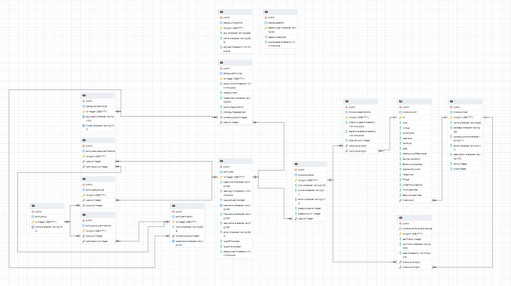

## Содержание  по проекту "Комфорт отель"
### Как установить проект
[Установка проекта](#install_PO) 
### Документация кода
[models.py](#models.py)  
[views.py](#views.py)  
[forms.py](#forms.py)  
[urls.py](#urls.py)  
[admin.py](#admin.py)  
[ERD](#erd_diddy)

# <a name="install_PO">Установка проекта</a>
### Создайте пустую папку и загрузите в него [Start.bat](https://github.com/Alexandr1810/HostelComfort/tree/ilya/.bat) и запустите
### По-итогу завершения работы bat файла будут установлены все библиотеки и созданы необходимые файлы для работы сайта  
### После в директории ../Hostle-Comfort/myproject откройте консоль и пропишите 
``` 
python manage.py runserver 
```
### Откроется наш проект с которым и предстоит работать

&nbsp;&nbsp;&nbsp;&nbsp;&nbsp;&nbsp;&nbsp;&nbsp;&nbsp;&nbsp;

# <a name="models.py">Model.py от Sergay</a> 

## Создание  таблиц в базе данных

#### Импорты
```
from django.db import models
from django.core.validators import MaxValueValidator, MinValueValidator
from django.contrib.auth.models import User
from django.core.exceptions import ValidationError
```

#### Cоздание таблицы  Hotel

#### рейтинг Отеля от 1 до 5 
```
class Hotel(models.Model):
    RATING_CHOICES = [
        (0, '0'),
        (1, '1'),
        (2, '2'),
        (3, '3'),
        (4, '4'),
        (5, '5'),
    ]
```
#### параметры таблицы Hotel
```
    name = models.CharField('Название', max_length=50)
    address = models.CharField('Адрес', max_length=50)
    contact_phone = models.CharField('Контактный номер', max_length=11)
    email = models.CharField('Email', max_length=100)
    description = models.CharField('Описание', max_length=100)
    rating = models.IntegerField(choices=RATING_CHOICES)
    price = models.IntegerField('Цена')
```
#### вывод данных в браузер для таблицы Отель
```
    def __str__(self):
        return self.name
```
#### подмена  названий на Отель, Отели
```
    class Meta:
        verbose_name = 'Отель'
        verbose_name_plural = 'Отели'
```
#### Выбор комнаты по её типу
```
class Room(models.Model):
    ROOM_TYPE_CHOICES = [
        (0, 'Одноместный'),
        (1, 'Двуместный'),
        (2, 'Люкс'),
    ]
```
#### наличие мини-бара или кондиционера
```
    BOOL_TYPE_CHOICES = [
        (0, 'Мини-Бар'), 
        (1, 'Кондиционер')
    ]
```
#### параметры таблицы Room
```
    hotel_id = models.ForeignKey(Hotel, on_delete=models.CASCADE, verbose_name='Отель')
    type = models.IntegerField('Тип комнаты', choices=ROOM_TYPE_CHOICES)
    minbar = models.BooleanField('Мини-Бар', default=True)
    conditioner = models.BooleanField('Кондиционер', default=True)
    television = models.BooleanField('Телевизор', default = True)
    hairdryer = models.BooleanField("Фен", default = True)
    safe = models.BooleanField("Сейф в номере", default = True)
    Kettle_or_coffee_maker = models.BooleanField("Чайник или кофеварка", default = True)
    Sound_insulation = models.BooleanField("Звукоизоляция", default = True)
    Balcony_or_terrace = models.BooleanField("Балкон или терраса", default = True)
    special_for_ivalid = models.BooleanField("Удобства для людей с ограниченными возможностями", default = True)
    Telephone = models.BooleanField("Телефон", default = True)
    Fridge = models.BooleanField("Холодильник", default = True)
    Underfloor_heating = models.BooleanField("Пол с подогревом", default = True)
    Work_facilities = models.BooleanField("Удобства для работы", default = True)
    Baby_cot_services = models.BooleanField("Услуги по предоставлению детской кроватки", default = True)
```

#### вывод данных в браузер для таблицы Room
```
    def __str__(self):
        # Получаем человекочитаемое название типа комнаты
        return f"{self.get_type_display()} (Отель: {self.hotel_id.name})"
```    
#### подмена  названий на Комната, Комнаты
```  
    class Meta:
        verbose_name = 'Комната'
        verbose_name_plural = 'Комнаты'
```
## Таблица Clients
```
class Clients(models.Model):
    user = models.OneToOneField(User, on_delete=models.CASCADE)  
    phio = models.CharField('ФИО', max_length=100)
    phone = models.CharField('Телефонный номер', max_length=11)
    email = models.CharField('Email', max_length=100)
    passport_seria = models.IntegerField('Серия паспорта')
    passport_num = models.IntegerField('Номер паспорта')
```
#### вывод данных в браузер для таблицы Clients
```
    def __str__(self):
        return self.phio
```
#### подмена  названий на Клиент, Клиенты
```
    class Meta:
        verbose_name = 'Клиент'
        verbose_name_plural = 'Клиенты'
```

## таблица Reservations
```
class Reservations(models.Model):
    client_id = models.ForeignKey(Clients, on_delete=models.CASCADE, verbose_name='Клиент')
    room_id = models.ForeignKey(Room, on_delete=models.CASCADE, verbose_name='Комната')
    check_in_date = models.DateTimeField('Дата заезда')
    departure_date = models.DateTimeField('Дата выезда')
    total_amount = models.IntegerField('Общая сумма')
```
#### вывод данных в браузер для таблицы Reservations
```
    def __str__(self):
        return f"Бронирование #{self.id} - {self.client_id.phio}"
```
#### подмена  названий на Бронирование, Бронирования
```
    class Meta:
        verbose_name = 'Бронирование'
        verbose_name_plural = 'Бронирования'
```

## таблица Reviews_and_ratings
```
class Reviews_and_ratings(models.Model):
    client_id = models.ForeignKey(Clients, on_delete=models.CASCADE, verbose_name='Клиент')
    hotel_id = models.ForeignKey(Hotel, on_delete=models.CASCADE, verbose_name='Отель')
    estimation = models.IntegerField('Оценка', validators=[MinValueValidator(1), MaxValueValidator(5)])
    comment = models.CharField('Комментарий', max_length=200)
    date = models.DateTimeField('Дата публикации', auto_now_add=True)
```
#### функци проверки корректности введённой даты
```
    def clean(self):
      if self.departure_date <= self.check_in_date:
        raise ValidationError("Дата выезда должна быть позже даты заезда")
```
#### вывод данных в браузер для таблицы Reviews_and_ratings
```
    def __str__(self):
        return f"Отзыв от {self.client_id.phio} ({self.estimation}/5)"
```
#### подмена  названий на Отзывы и оценки
```
    class Meta:
        verbose_name = 'Отзыв и оценка'
        verbose_name_plural = 'Отзывы и оценки'
```

# <a name="views.py">Views.py от Sergay</a> 

#### импорт перенаправления на страницы сайта
```
from django.shortcuts import render, redirect, get_object_or_404
from django.contrib.auth.decorators import login_required, user_passes_test
from django.contrib.auth import authenticate, login, logout
from .models import Hotel, Room, Clients, Reservations, User
from django.contrib import messages
from .forms import RegisterForm, LoginForm
from django.core.exceptions import ObjectDoesNotExist
```
#### Отображение главной страницы с перечнем всех отелей
```
def hotel(request):
    hotel = Hotel.objects.all()
    return render(request, 'hotel/index.html', {'hotel': hotel})
```
#### Отображение детальной информации об отеле, включая доступные номера.
```
def hotel_detail(request, id):
    hotel = get_object_or_404(Hotel, id=id)
    # Используем hotel_id вместо hotel
    rooms = Room.objects.filter(hotel_id=hotel.id)
    
    client = None
    if request.user.is_authenticated:
        try:
            client = request.user.clients
        except User.clients.RelatedObjectDoesNotExist:
            pass
    
    context = {
        'hotel': hotel,
        'rooms': rooms,
        'client': client
    }
    return render(request, 'hotel/hotel_info.html', context)
```
#### Отображение страницы бронирования для указанного отеля.
```
def booking(request, id):
    hotel = get_object_or_404(Hotel, id=id)
    return render(request, 'hotel/booking.html', {'hotel': hotel})
```
#### Отображение страницы  с информацией о бронировании.
```
def booking_info(request, id):
    hotel = get_object_or_404(Hotel, id=id)
    return render(request, 'hotel/booking_info.html', {'hotel': hotel})
```
#### Обработка  регистрации нового пользователя и перенаправление на главную страницу после успешной регистрации.
```
def register(request):
    if request.method == 'POST':
        form = RegisterForm(request.POST)
        if form.is_valid():
            user = form.save()
            Clients.objects.create(
                user=user,
                phio=form.cleaned_data['phio'],
                phone=form.cleaned_data['phone'],
                email=form.cleaned_data['email'],
                passport_seria=form.cleaned_data['passport_seria'],
                passport_num=form.cleaned_data['passport_num']
            )
            login(request, user)
            return redirect('hotel')  # Перенаправляем на главную страницу
        else:
            # Добавляем сообщения об ошибках
            for field, errors in form.errors.items():
                for error in errors:
                    messages.error(request, f"{field}: {error}")
    else:
        form = RegisterForm()
    
    return render(request, 'registration/register.html', {'form': form})
```
#### Обрабатка процесса входа пользователя в систему и перенаправление на профиль  после успешного входа.
```
def user_login(request):
    if request.method == 'POST':
        form = LoginForm(request, data=request.POST)
        if form.is_valid():
            username = form.cleaned_data.get('username')
            password = form.cleaned_data.get('password')
            user = authenticate(request, username=username, password=password)
            if user is not None:
                login(request, user)
                return redirect('user_profile')
        messages.error(request, 'Неверный телефон/email или пароль')
    else:
        form = LoginForm()
    return render(request, 'registration/login.html', {'form': form})
```
#### Обработка выхода пользователя из системы.
```
def user_logout(request):
    logout(request)
    return redirect('login')
```
#### Отображение профиля пользователя и его бронирования.
```
@login_required
def user_profile(request):
    try:
        client = request.user.clients  # Пытаемся получить связанного клиента
    except ObjectDoesNotExist:
        # Если клиент не существует, перенаправляем на заполнение профиля
        return redirect('complete_profile')
    reservations = Reservations.objects.filter(client_id=client)
    return render(request, 'profile/user.html', {
        'client': client,
        'reservations': reservations
    })

```
#### Проверка является ли пользователь менеджером
```
def is_manager(user):
    return user.role == 'manager'
```
#### Отображение  панели управления для менеджера и вывод HTML-страницы с данными о всех отелях и клиентах.

```
@login_required
@user_passes_test(is_manager)
def manager_dashboard(request):
    hotels = Hotel.objects.all()
    clients = Clients.objects.all()
    return render(request, 'manager/dashboard.html', {
        'hotels': hotels,
        'clients': clients
    })
```
#### Позволяет менеджеру редактировать информацию об отеле и возвращает HTML-страницу с формой редактирования отеля или перенаправляет на панель управления после успешного обновления.
```
@login_required
@user_passes_test(is_manager)
def edit_hotel(request, id):
    hotel = get_object_or_404(Hotel, id=id)
    if request.method == 'POST':
        # Логика обновления отеля
        hotel.name = request.POST.get('name')
        hotel.address = request.POST.get('address')
        hotel.save()
        return redirect('manager_dashboard')
    return render(request, 'manager/edit_hotel.html', {'hotel': hotel})
```
#### Позволяет менеджеру редактировать информацию о клиенте.
```
@login_required
@user_passes_test(is_manager)
def edit_client(request, id):
    client = get_object_or_404(Clients, id=id)
    if request.method == 'POST':
        # Логика обновления клиента
        client.phio = request.POST.get('phio')
        client.phone = request.POST.get('phone')
        client.save()
        return redirect('manager_dashboard')
```
# <a name="forms.py">forms.py от Sergay</a>
#### импорт из django необходимых модулей для создания форм 
```
from django import forms
from django.contrib.auth.forms import UserCreationForm
from django.contrib.auth.forms import AuthenticationForm
```
#### формы для входа на сайт
```
class LoginForm(AuthenticationForm):
    username = forms.CharField(label='Телефон или Email')
    password = forms.CharField(label='Пароль', widget=forms.PasswordInput)
```
#### формы для регистрациии на сайте
```
class RegisterForm(UserCreationForm):
    phio = forms.CharField(label='ФИО', max_length=100, required=True)
    phone = forms.CharField(label='Телефон', max_length=11, required=True)
    email = forms.EmailField(label='Email', required=True)
    passport_seria = forms.IntegerField(label='Серия паспорта', required=True)
    passport_num = forms.IntegerField(label='Номер паспорта', required=True)
```
#### заполнение полей из формы
```
    class Meta(UserCreationForm.Meta):
        fields = ('username', 'email', 'password1', 'password2',
                 'phio', 'phone', 'passport_seria', 'passport_num')
```

# <a name="urls.py">Urls.py от Sergay</a> 

#### импорт из views.py
```
from django.urls import path
from . import views
```
#### вариации ссылок на страницы 
```
urlpatterns = [
    path('', views.hotel, name='hotel'),
    path('hotel/<int:id>/', views.hotel_detail, name='hotel_detail'),
    path('booking/<int:id>/', views.booking, name='booking'),
    path('booking_info/<int:id>/', views.booking_info, name='booking_info'),
    path('login/', views.user_login, name='login'),
    path('logout/', views.user_logout, name='logout'),
    path('register/', views.register, name='register'),
    path('profile/', views.user_profile, name='user_profile'),
]
```

# <a name="admin.py">admin.py от Sergay</a> 

#### импортируем из файла .models наши таблицы
```
from django.contrib import admin
from .models import Hotel, Room, Clients, Reservations, Reviews_and_ratings
from django.contrib.auth.admin import UserAdmin
from django.contrib.auth.models import User
```
####
```
class ClientsInline(admin.StackedInline):
    model = Clients
    can_delete = False
    verbose_name_plural = 'Дополнительная информация'
```
####
```
class CustomUserAdmin(UserAdmin):
    inlines = (ClientsInline,)
```
#### вывод таблицы на странице адмиинистратора django
```
admin.site.unregister(User)
admin.site.register(User, CustomUserAdmin)
admin.site.register(Clients)
admin.site.register(Hotel)
admin.site.register(Room)
admin.site.register(Reservations)
admin.site.register(Reviews_and_ratings)
```

### ER-диаграмма<a name="erd_diddy"></a> 